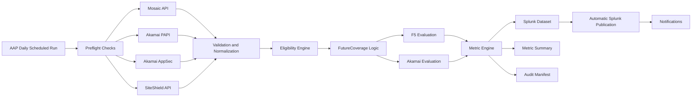
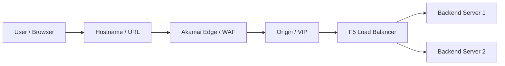
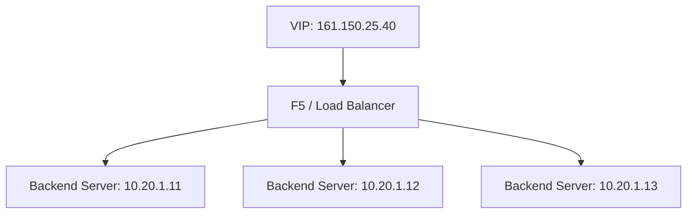
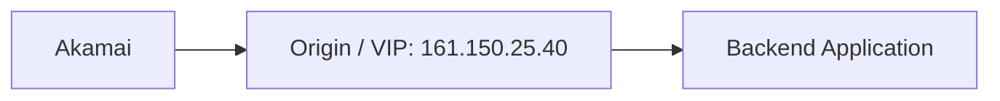
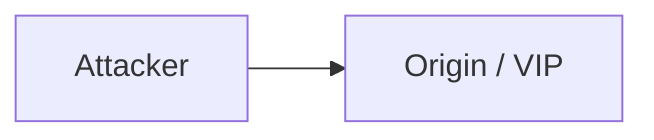
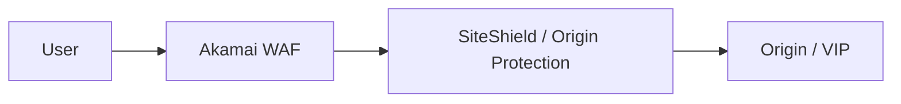
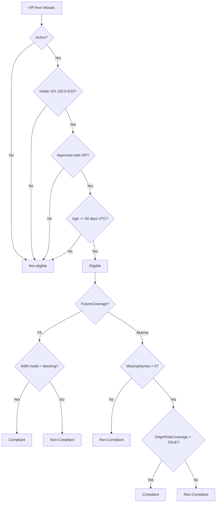

# MET-37883481 - WAF Coverage Metric Automation

## 1. Purpose

This page explains the complete requirement for **MET-37883481 - WAF Coverage Metric Automation** from an automation developer point of view.

The target solution must replace the current email, laptop, PowerShell, manual CSV, and manual Splunk upload process with a centrally managed **Ansible Automation Platform (AAP)** workflow.

The automation must run daily, retrieve authoritative data from Mosaic, Akamai, and SiteShield sources, validate source integrity, apply approved WAF coverage rules, calculate the metric, generate Splunk-ready outputs and audit evidence, publish to Splunk, and send notifications.

---

## 2. Business Objective

The organization needs to measure whether internet-facing web applications are protected by approved Web Application Firewall controls.

The metric answers this question:

> Out of all eligible internet-facing web VIPs, what percentage are correctly protected by the expected WAF control?

The approved metric formula is:

```text
Coverage Percentage = (Complete Eligible VIPs / Total Eligible VIPs) * 100
```

The result is rounded to the nearest whole number.

Status logic:

```text
Coverage >= 96%  -> Green
Coverage < 96%   -> Non-Green
```

The exact final non-green label still needs confirmation.

---

## 3. High-Level Target Architecture



---

## 4. Basic Web Application Traffic Flow



Example:

```text
User accesses:       https://payments.example.com
Hostname:            payments.example.com
Origin / VIP:        161.150.25.40
Backend servers:     10.20.1.11, 10.20.1.12
```

Important point:

> The metric is counted at VIP level, not hostname level and not backend server level.

---

## 5. Terminology Explained

### 5.1 Hostname / URL

A hostname is the human-readable name used by users or systems.

Example:

```text
payments.example.com
login.example.com
api.example.com
```

One VIP can have multiple hostnames or aliases.

Example:

```text
VIP: 161.150.25.40

Hostnames:
- payments.example.com
- api-payments.example.com
- secure-payments.example.com
```

For Akamai compliance, all required hostnames must be protected.

---

### 5.2 IP Address

An IP address is a network address.

Example:

```text
161.150.25.40
10.20.1.11
```

But not every IP means the same thing. One IP may be a VIP, another may be an actual backend server.

---

### 5.3 VIP

VIP means **Virtual IP**.

A VIP is a logical IP that represents an application or service. It usually sits in front of one or more backend servers.



In this automation:

```text
Metric Grain = VIP
```

That means each VIP is counted as one metric object.

---

### 5.4 Backend IP

A backend IP is usually the actual server or application node IP behind the VIP.

Example:

```text
VIP:             161.150.25.40
Backend IPs:     10.20.1.11, 10.20.1.12
```

The backend is where the application actually runs. The VIP is the front logical address used by upstream systems.

---

### 5.5 Origin / Origin IP

From Akamai's point of view, the **origin** is the destination Akamai sends traffic to after processing it.



The same IP can be called different things depending on perspective:

| Perspective | Term |
|---|---|
| Akamai | Origin |
| F5 / Network | VIP |
| Application team | Application endpoint |

So `161.150.25.40` may be the Akamai origin and also the F5 VIP.

---

### 5.6 WAF

WAF means **Web Application Firewall**.

A normal firewall mostly works with IPs, ports, and protocols. A WAF understands HTTP/HTTPS web traffic.

A WAF can detect and block application-layer attacks such as:

- SQL injection
- Cross-site scripting
- malicious bots
- suspicious HTTP payloads
- known exploit patterns

---

### 5.7 F5

F5 is commonly used for load balancing and application delivery.

In this project, F5 is also one of the approved WAF protection paths.

For the F5 path, the important compliance condition is:

```text
ltm_asm_mode = blocking
```

---

### 5.8 F5 ASM

ASM means **Application Security Manager**.

It is the F5 WAF capability.

If ASM is in blocking mode, malicious traffic can be blocked.

If ASM is in monitoring/transparent mode, it may detect attacks but still allow traffic.

Therefore:

```text
FutureCoverage = F5
AND
ltm_asm_mode = blocking

=> Compliant
```

---

### 5.9 Akamai

Akamai is an edge platform that can provide CDN, WAF, bot protection, DDoS protection, routing, and application security.

In this project, Akamai is the second approved WAF protection path.

Akamai sits in front of the application and receives Internet traffic before forwarding it to the customer origin.

---

### 5.10 Akamai AppSec

Akamai AppSec provides hostname WAF coverage information.

It tells us whether the required application hostnames are protected by Akamai security configurations and policies.

Example:

```text
Required hostnames from Mosaic:
- app.example.com
- api.example.com

Protected hostnames from Akamai AppSec:
- app.example.com

MissingNames = 1
```

For Akamai compliance:

```text
MissingNames must be 0
```

---

### 5.11 SiteShield

SiteShield is used to validate origin protection.

The reason it matters is simple: even if Akamai protects the hostname, the origin must not be directly reachable in a way that bypasses Akamai.

Bad path:



Good path:



For this automation, SiteShield API provides:

- protected origins
- origin IP information

This is used to derive:

```text
OriginRuleCoverage = TRUE/FALSE
```

For Akamai path compliance:

```text
OriginRuleCoverage = TRUE
AND
MissingNames = 0

=> Compliant
```

---

### 5.12 Splunk

Splunk is used for searching, reporting, analytics, dashboards, and operational visibility.

The automation must publish the generated metric outputs automatically to Splunk.

This replaces the old manual CSV lookup upload process.

---

### 5.13 RunID

RunID is the unique identifier for one automation execution.

It ties together:

- VIP-level records
- metric summary
- audit manifest
- logs
- Splunk publication status

---

### 5.14 CalculationVersion

CalculationVersion identifies which version of the metric logic produced the result.

This is important because business logic can change over time.

---

### 5.15 ReasonCode

ReasonCode explains why a VIP is compliant or non-compliant.

Examples of possible reason-code categories:

```text
F5_ASM_NOT_BLOCKING
AKAMAI_HOSTNAME_MISSING
AKAMAI_ORIGIN_NOT_PROTECTED
UNDER_60_DAYS
OUTSIDE_CIDR
NOT_ACTIVE
```

The final approved reason-code catalogue still needs to be confirmed.

---

## 6. Source Systems

| Source System | Purpose | Data Provided |
|---|---|---|
| Mosaic | Primary inventory source | VIP, hostnames, creation date, ASM status, active status, ownership, mnemonics, metadata |
| Akamai PAPI | Akamai group/property data | Group data, mnemonic mapping, coverage assignment information |
| Akamai AppSec | Hostname WAF coverage | Hostname coverage, configuration names, policy names, coverage status |
| SiteShield API | Origin protection | Protected origins, origin IP information |
| Splunk | Reporting target | VIP dataset, metric summary, dashboards, audit/search visibility |

---

## 7. Detailed Target Workflow

### Step 1 - Start Scheduled Run

AAP starts the daily automation workflow.

Purpose:

```text
Initiate metric calculation using a controlled and repeatable process.
```

---

### Step 2 - Perform Preflight Checks

Validate before processing:

- configuration
- credentials
- API connectivity
- required dependencies
- required schemas
- Splunk connectivity

Purpose:

```text
Ensure all required systems are available before processing begins.
```

If a mandatory source is unavailable, the automation should not generate a misleading metric.

---

### Step 3 - Retrieve Mosaic Inventory

Collect the latest URL/VIP inventory from Mosaic.

Mosaic provides:

- VIP
- hostnames / aliases
- creation date
- active status
- ASM status
- application ownership
- mnemonics
- metadata

Purpose:

```text
Obtain the authoritative list of VIPs and application metadata.
```

---

### Step 4 - Retrieve Akamai Group Data

Collect group and mapping information from Akamai PAPI.

Purpose:

```text
Determine whether applications are expected to follow the F5 path or Akamai path.
```

---

### Step 5 - Retrieve Akamai Hostname Coverage

Collect hostname coverage details from Akamai AppSec.

Purpose:

```text
Determine whether required hostnames are protected by Akamai WAF controls.
```

---

### Step 6 - Retrieve SiteShield Origin Protection Data

Collect SiteShield protected-origin and origin-IP data.

Purpose:

```text
Determine whether Akamai origins have approved origin protection.
```

This replaces:

- email attachment workflow
- local CSV handling
- laptop storage
- hardcoded SiteShield IP list
- PowerShell SiteShield enrichment

---

### Step 7 - Validate and Normalize Source Data

Normalize data from all systems into a common internal VIP model.

Validation must include:

- schema validation
- freshness checks
- hostname normalization
- IP/CIDR validation

Example normalized record:

```yaml
vip: 161.150.25.40
active: true
created_date_utc: "2026-06-01T00:00:00Z"
hostnames:
  - app.example.com
  - api.example.com
asm_mode: blocking
future_coverage: null
origin_rule_coverage: null
missing_names: null
eligible: false
compliant: false
reason_code: null
```

---

### Step 8 - Establish Metric Population

Apply eligibility rules and determine which VIPs participate in the metric.

Confirmed eligibility rules:

| Rule | Requirement |
|---|---|
| Active status | `active = TRUE` |
| CIDR | VIP belongs to `161.150.0.0/16` |
| Web VIP | VIP represents a web service based on approved web-VIP rules |
| Duplicate handling | Duplicate VIPs removed |
| Grace period | VIP age is at least 60 days using UTC |

The result of this step becomes the denominator.

```text
Denominator = Total Eligible VIPs
```

---

### Step 9 - Apply 60-Day UTC Rule

A VIP becomes eligible exactly at:

```text
60 days
00 hours
00 minutes
00 seconds
```

Examples:

```text
59d 23:59:59  -> not eligible
60d 00:00:00  -> eligible
```

This must be unit tested carefully.

---

### Step 10 - Apply FutureCoverage Logic

FutureCoverage determines which protection model each eligible VIP is expected to use.

Possible outcomes:

```text
F5
Akamai
```

Processing order:

```text
Default FutureCoverage decision
        ↓
Business overrides
        ↓
Final FutureCoverage
```

Business overrides must be formally approved. Do not invent override rules in code.

---

### Step 11 - Evaluate F5 Path

For eligible VIPs where:

```text
FutureCoverage = F5
```

compliance rule is:

```text
ltm_asm_mode = blocking
```

If true:

```text
Compliant = TRUE
```

Otherwise:

```text
Compliant = FALSE
```

---

### Step 12 - Evaluate Akamai Path

For eligible VIPs where:

```text
FutureCoverage = Akamai
```

both conditions must pass:

```text
OriginRuleCoverage = TRUE
AND
MissingNames = 0
```

If both pass:

```text
Compliant = TRUE
```

Otherwise:

```text
Compliant = FALSE
```

---

### Step 13 - Assign ReasonCode

Every VIP should have a ReasonCode explaining the classification.

This allows Splunk users and application teams to understand why a VIP is compliant or non-compliant.

The final ReasonCode catalogue must be approved before production.

---

### Step 14 - Calculate Numerator

The numerator is the count of eligible VIPs that are compliant.

```text
Numerator = count(Eligible = TRUE and Compliant = TRUE)
```

---

### Step 15 - Calculate Denominator

The denominator is the count of eligible VIPs.

```text
Denominator = count(Eligible = TRUE)
```

---

### Step 16 - Calculate Coverage Percentage

```text
Coverage % = (Numerator / Denominator) * 100
```

The result is rounded to the nearest whole number.

Open item:

```text
Denominator = 0 behavior must be formally confirmed.
```

---

### Step 17 - Determine Final Status

```text
Coverage >= 96%  -> Green
Coverage < 96%   -> Non-Green
```

The non-green label still needs confirmation.

---

### Step 18 - Generate Splunk Dataset

The Splunk dataset is the VIP-level output.

Required fields:

| Field | Meaning |
|---|---|
| VIP | VIP being evaluated |
| Eligible | Whether the VIP is included in the metric population |
| FutureCoverage | Expected protection path: F5 or Akamai |
| OriginRuleCoverage | Whether origin protection requirement passed |
| MissingNames | Number of required hostnames missing in Akamai AppSec |
| Compliant | Final VIP compliance result |
| ReasonCode | Explanation of result |
| CalculationVersion | Version of metric logic |
| RunID | Unique run identifier |

---

### Step 19 - Generate Metric Summary

Metric summary contains run-level result information.

Required fields:

- Run ID
- Reporting Date
- Source Counts
- Numerator
- Denominator
- Coverage %
- Status

---

### Step 20 - Generate Audit Manifest

Audit manifest contains evidence for the automation run.

Required fields:

- Run ID
- Start Time
- End Time
- Duration
- Source Counts
- Source Versions
- Git Commit
- Validation Results
- Publication Status

Purpose:

```text
Make every metric run traceable, explainable, and auditable.
```

---

### Step 21 - Publish to Splunk

Automatically publish generated output to Splunk.

Purpose:

```text
Update dashboards and reporting with latest metric data.
```

Splunk publication method still needs confirmation:

- HEC
- REST API
- lookup API
- index ingestion
- internal enterprise integration

---

### Step 22 - Send Notifications

Send notification after run completion.

Known distribution:

```text
akamai.solutions@pnc.com
```

Notification should include:

- Run ID
- status
- coverage percentage
- numerator
- denominator
- Splunk publication status
- failure reason if failed

---

## 8. Compliance Decision Logic

### 8.1 Overall Decision Tree



---

### 8.2 F5 Path

```text
IF FutureCoverage = F5
AND ltm_asm_mode = blocking
THEN Compliant = TRUE
ELSE Compliant = FALSE
```

---

### 8.3 Akamai Path

```text
IF FutureCoverage = Akamai
AND MissingNames = 0
AND OriginRuleCoverage = TRUE
THEN Compliant = TRUE
ELSE Compliant = FALSE
```

---

## 9. Example Calculations

### Example 1 - F5 Compliant VIP

```yaml
vip: 161.150.25.40
active: true
created_days_ago: 90
web_vip: true
future_coverage: F5
ltm_asm_mode: blocking
```

Result:

```text
Eligible = TRUE
Compliant = TRUE
Denominator +1
Numerator +1
```

---

### Example 2 - F5 Non-Compliant VIP

```yaml
vip: 161.150.25.41
active: true
created_days_ago: 90
web_vip: true
future_coverage: F5
ltm_asm_mode: transparent
```

Result:

```text
Eligible = TRUE
Compliant = FALSE
Denominator +1
Numerator +0
```

---

### Example 3 - Akamai Compliant VIP

```yaml
vip: 161.150.25.42
active: true
created_days_ago: 120
web_vip: true
future_coverage: Akamai
missing_names: 0
origin_rule_coverage: true
```

Result:

```text
Eligible = TRUE
Compliant = TRUE
Denominator +1
Numerator +1
```

---

### Example 4 - Akamai Non-Compliant Due to Missing Hostname

```yaml
vip: 161.150.25.43
future_coverage: Akamai
missing_names: 1
origin_rule_coverage: true
```

Result:

```text
Eligible = TRUE
Compliant = FALSE
Reason: required hostname missing from Akamai AppSec protection
```

---

### Example 5 - Akamai Non-Compliant Due to Missing Origin Protection

```yaml
vip: 161.150.25.44
future_coverage: Akamai
missing_names: 0
origin_rule_coverage: false
```

Result:

```text
Eligible = TRUE
Compliant = FALSE
Reason: origin protection not confirmed
```

---

## 10. Output Deliverables

### 10.1 Splunk Dataset

Record-level output for Splunk.

Required fields:

```text
VIP
Eligible
FutureCoverage
OriginRuleCoverage
MissingNames
Compliant
ReasonCode
CalculationVersion
RunID
```

---

### 10.2 Metric Summary

Run-level summary.

Required fields:

```text
Run ID
Reporting Date
Source Counts
Numerator
Denominator
Coverage %
Status
```

---

### 10.3 Audit Manifest

Audit evidence.

Required fields:

```text
Run ID
Start Time
End Time
Duration
Source Counts
Source Versions
Git Commit
Validation Results
Publication Status
```

---

## 11. Risks and Mitigations

| Risk | Impact | Mitigation |
|---|---|---|
| SiteShield API unavailable | Metric unavailable | Fail closed |
| Akamai schema changes | Processing failure | Schema validation |
| Unknown override logic | Incorrect classification | Formal approval |
| Missing Splunk logic | KPI mismatch | Reconcile during UAT |
| Stale source data | Invalid metric | Freshness validation |

---

## 12. Approved Decisions

| Decision | Status |
|---|---|
| Metric grain = VIP | Approved |
| Execution platform = AAP | Approved |
| Daily execution | Approved |
| Splunk publication required | Approved |
| SiteShield source = API | Approved |
| Eligible CIDR = 161.150.0.0/16 | Approved |
| Grace Period = 60 Days UTC | Approved |

---

## 13. Assumptions

| ID | Assumption |
|---|---|
| A1 | Metric grain is VIP |
| A2 | AAP is execution platform |
| A3 | SiteShield data is provided through an API |
| A4 | Splunk publication is required |
| A5 | Execution schedule is daily |

---

## 14. Recommended Repository Structure

```text
boundary_protection_automation/
├── playbooks/
├── roles/
├── config/
├── schemas/
├── tests/
├── docs/
└── runbooks/
```

Recommended role structure:

```text
roles/
├── preflight/
├── mosaic/
├── akamai_papi/
├── akamai_appsec/
├── siteshield/
├── normalize/
├── eligibility/
├── future_coverage/
├── f5_evaluation/
├── akamai_evaluation/
├── metric_engine/
├── output_generation/
├── splunk_publish/
├── notification/
└── audit/
```

Recommended main playbook:

```text
playbooks/waf_coverage.yml
```

The main playbook should orchestrate roles. It should not contain all business logic directly.

---

## 15. Configuration-Driven Rules

Business rules should be stored in configuration, not hardcoded across task files.

Example:

```yaml
eligible_cidr: "161.150.0.0/16"
grace_period_days: 60
green_threshold: 96
calculation_version: "v1.0"
web_vip_patterns:
  - "-443"
  - "-80"
  - "_443"
```

Important:

> The exact approved web-VIP patterns and override logic must be confirmed before production implementation.

---

## 16. Schema Validation

Create schemas for all major input/output contracts.

Recommended schemas:

```text
schemas/
├── mosaic.json
├── akamai_papi.json
├── akamai_appsec.json
├── siteshield.json
└── splunk_output.json
```

If an upstream API changes unexpectedly, the automation should stop instead of producing a wrong metric.

---

## 17. AAP Credential Handling

Credentials should be managed through AAP credentials, not through surveys.

AAP credentials likely needed for:

- Mosaic
- Akamai PAPI
- Akamai AppSec
- SiteShield API
- Splunk
- Notification/email integration

Survey inputs should be limited to operational controls such as:

- dry run mode
- publish to Splunk true/false
- send notification true/false
- reporting date override for testing
- log verbosity

---

## 18. Testing Strategy

### 18.1 Unit Tests

Validate:

- 60-day boundary
- CIDR membership
- ASM modes
- Akamai coverage
- Missing hostnames
- SiteShield matching
- override logic
- reason codes

---

### 18.2 Integration Tests

Validate:

- Mosaic retrieval
- Akamai retrieval
- SiteShield retrieval
- Splunk publication

---

### 18.3 UAT Tests

Validate:

- VIP classification
- coverage results
- numerator
- denominator
- final percentage

UAT should compare automation results against the currently accepted business/Splunk calculation until reconciled.

---

## 19. Recommended Build Order

Recommended implementation sequence:

```text
1. API mocks
2. Normalization
3. Eligibility engine
4. FutureCoverage classification
5. F5 evaluation
6. Akamai evaluation
7. Metric calculation
8. Output generation
9. Real API integrations
10. Splunk publication
11. AAP scheduling
12. Notifications
```

Reason:

> The hardest part is the business logic. If API calls are connected before logic is stable, debugging becomes messy.

---

## 20. Development Blockers / Clarifications Needed

Before production development, clarify the following:

| Missing Item | Why It Matters |
|---|---|
| Mosaic API endpoint and sample response | Required for inventory retrieval and schema mapping |
| Mosaic authentication method | Required for AAP credential setup |
| Akamai PAPI endpoint and response | Required for group/mnemonic mapping |
| Akamai AppSec endpoint and response | Required for hostname coverage calculation |
| SiteShield API endpoint and response | Required for origin protection calculation |
| Exact OriginRuleCoverage algorithm | Required to avoid wrong Akamai compliance result |
| Exact FutureCoverage default logic | Required to decide F5 vs Akamai path |
| Business override table | Required because overrides change classification |
| Exact approved web-VIP criteria | Required for denominator accuracy |
| Duplicate handling rule | Required for correct VIP counts |
| Hostname normalization rules | Required to avoid false MissingNames |
| Freshness thresholds | Required for stale-source validation |
| Reason-code catalogue | Required for Splunk output consistency |
| CalculationVersion convention | Required for auditability |
| Splunk ingestion mechanism | Required for publication implementation |
| Splunk index/sourcetype/lookup target | Required for dashboards/reporting |
| Notification mechanism/template | Required for Step 13 |
| Denominator = 0 behavior | Required to avoid invalid metric |
| Final non-green status label | Required for metric summary |
| Durable audit storage/retention | Required if audit evidence must survive AAP EE lifecycle |
| API rate limits and pagination | Required for reliable scheduled execution |
| AAP network access to APIs/Splunk | Required for runtime connectivity |

Biggest blocker:

> FutureCoverage and business override logic. Guessing here would produce incorrect classifications.

---

## 21. Full 55-Point Requirement Explanation

1. The business problem is to prove WAF coverage for eligible internet-facing web VIPs.
2. The metric formula is compliant eligible VIPs divided by total eligible VIPs, multiplied by 100.
3. A typical application path is user -> hostname -> Akamai/F5 -> origin/VIP -> backend server.
4. A hostname is the user-facing application name such as `app.example.com`.
5. An IP address is a network address, but not every IP represents a server.
6. A VIP is a Virtual IP representing an application/service and is the approved metric grain.
7. A backend server is the actual system that runs the application behind the VIP.
8. A load balancer distributes traffic from one VIP to multiple backend servers.
9. F5 is used for application delivery, load balancing, and security functions.
10. F5 ASM is the F5 WAF function; this metric requires ASM blocking mode for F5 compliance.
11. WAF means Web Application Firewall and protects web applications at HTTP/HTTPS layer.
12. Akamai is an edge/security platform used to protect and route internet traffic.
13. Akamai AppSec provides hostname WAF coverage, configuration, policy, and coverage evidence.
14. MissingNames means required hostnames missing from Akamai protection.
15. Origin means the destination Akamai forwards requests to after edge processing.
16. Origin IP and backend IP are not always the same; the origin may be an F5 VIP.
17. Akamai WAF alone is insufficient if the origin can be reached directly and bypassed.
18. SiteShield validates origin protection and helps prevent direct origin bypass.
19. OriginRuleCoverage means whether the origin protection requirement is satisfied.
20. AppSec and SiteShield together prove hostname coverage plus origin protection.
21. Mosaic is the authoritative source for VIP inventory and metadata.
22. An alias is an additional hostname associated with the same application/VIP.
23. Akamai PAPI provides group/mnemonic/coverage assignment data for Akamai mapping.
24. A mnemonic is an identifier used to correlate applications across systems.
25. FutureCoverage is the business classification of the expected protection path: F5 or Akamai.
26. FutureCoverage is needed because F5 and Akamai have different compliance rules.
27. Business overrides are formally approved changes applied after default FutureCoverage decision.
28. CIDR `161.150.0.0/16` defines the approved eligible VIP network range.
29. The 60-day grace period prevents newly created VIPs from counting immediately.
30. UTC is required for exact cross-system 60-day boundary consistency.
31. Eligible population is created using active, CIDR, web-VIP, dedupe, and age filters.
32. Denominator means total eligible VIPs after all filters.
33. Numerator means eligible VIPs that are also compliant.
34. Coverage is numerator divided by denominator, then rounded to nearest whole number.
35. F5 compliant example: eligible VIP + FutureCoverage F5 + ASM blocking.
36. F5 non-compliant example: eligible VIP + FutureCoverage F5 + ASM not blocking.
37. Akamai compliant example: MissingNames 0 and OriginRuleCoverage TRUE.
38. Akamai hostname failure means any missing required hostname makes VIP non-compliant.
39. Akamai SiteShield failure means origin protection missing makes VIP non-compliant.
40. ReasonCode explains exactly why a VIP is compliant or non-compliant.
41. Splunk receives and reports the detailed and summary metric results.
42. Splunk dataset is the VIP-level output contract.
43. RunID uniquely ties records, summary, logs, and audit for one execution.
44. CalculationVersion identifies which business logic version generated the result.
45. Metric summary gives run-level numerator, denominator, percentage, and status.
46. Audit manifest proves how, when, and with what source/code version the metric ran.
47. Git commit in audit connects the result to the exact automation code revision.
48. Schema validation prevents bad assumptions when upstream API responses change.
49. Freshness validation prevents stale source data from producing an invalid metric.
50. Fail closed means stop rather than publish a misleading metric when required evidence is missing.
51. AAP is the centralized execution platform for scheduling, credentials, RBAC, and history.
52. AAP replaces laptop-based manual processing and fragile email attachment flows.
53. The new process uses APIs, validation, eligibility, FutureCoverage, evaluations, metric engine, Splunk, and notifications.
54. As Ansible developers, separate acquisition, processing, business logic, and reporting layers.
55. The end proof is that every mature active web VIP in scope has the expected WAF path correctly configured.

---

## 22. Final Target Statement

The future-state solution will replace the current email, laptop, PowerShell, and manual-upload workflow with a centrally managed AAP-based automation that retrieves authoritative Mosaic, Akamai, and SiteShield data sources; validates source integrity; applies approved WAF coverage rules; calculates MET-37883481; generates Splunk-ready outputs, metric summaries, and audit evidence; publishes results automatically to Splunk; and operates through a repeatable, auditable, and fully automated enterprise process.
